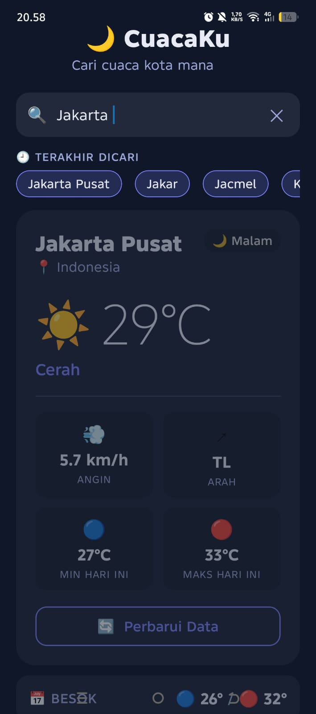

# 🌤️ CuacaKu — WeatherFinder App

> Aplikasi cuaca real-time berbasis React Native + Expo yang memanfaatkan Open-Meteo API (gratis, tanpa API key).

## 📱 Screenshots

| Kosong (Idle) | Loading | Sukses | Error |
|:---:|:---:|:---:|:---:|
|  |  |  |  |
| Tampilan awal saat app dibuka | Spinner saat fetch berlangsung | Kartu cuaca lengkap | Pesan merah saat kota tidak ditemukan |

---

## ✨ Fitur Aplikasi

- Input nama kota → fetch otomatis (debounce)
- Geocoding pakai Open-Meteo
- Forecast (current weather + daily min/max)
- State: idle | loading | error | success
- History kota terakhir (maks 5)
- Tema warna dinamis berdasarkan kondisi cuaca

## 🔗 Expo Snack

[Buka di Expo Snack](https://snack.expo.dev/@gio122/praktek_per_10?platform=web)

---

## 🌐 API Reference

### Step 1 — Geocoding
```
GET https://geocoding-api.open-meteo.com/v1/search
  ?name=Jakarta
  &count=1
  &language=id
```

### Step 2 — Forecast
```
GET https://api.open-meteo.com/v1/forecast
  ?latitude=-6.21
  &longitude=106.84
  &current_weather=true
  &daily=temperature_2m_max,temperature_2m_min
  &timezone=auto
```

---

👤 Dibuat oleh

**Gio perjuangan Barus**

